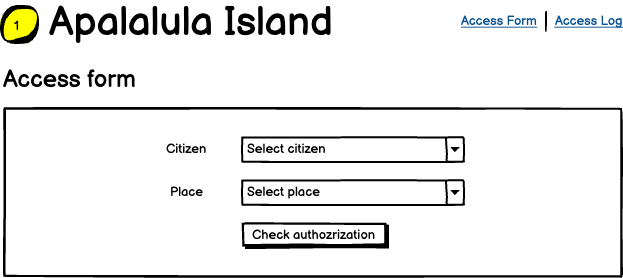
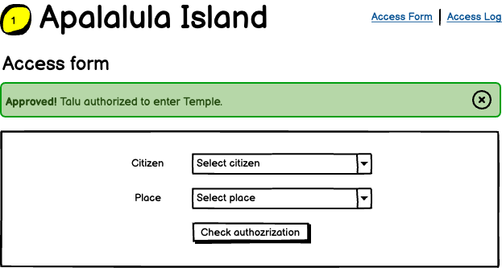
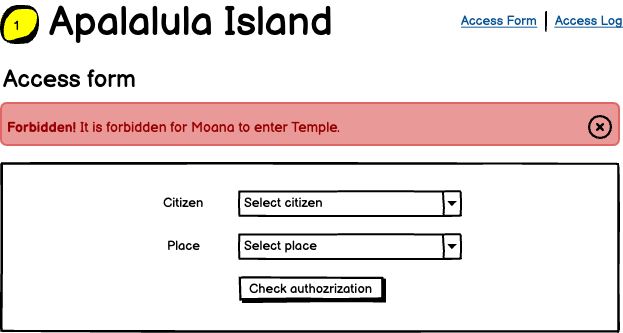
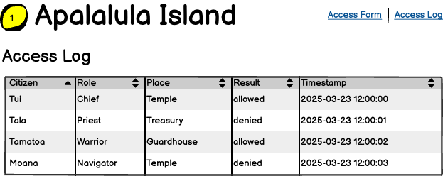

# Problem

Maui was asked by the gods to guard Apulalula Island and grant access to important places only for those worthy. Maui excels at combat but struggles with memory, especially regarding who is allowed to enter specific locations.

**Your mission: Help Maui manage access control with a robust full-stack tool.**

## Maui's Requirements for the Tool

1. Maintain records of all places, citizens and roles (can be hardcoded).
2. Roles are granting access to specific places.
3. Roles can have sub-roles, inheriting permissions (access to places) of their parent roles.
4. All citizens should be assigned to a role (can be hardcoded).
5. Maui will use the tool to verify citizen access, so a user-friendly UI is essential.
6. **Record every access check (allowed or denied) in the system and provide a UI to review access logs.**

## Your Task

Create a full-stack web application with both frontend and backend components, storing data in a database of your choice (MongoDB preferred, but you may choose any suitable database).

## Technical Requirements

### Frontend
- Develop an intuitive UI using React (preferred) or another modern framework.
- UI must include:
  - Form with dropdown fields to select citizens and places.
  - Upon submission, validate access via backend and clearly indicate approval or denial.
  - **Separate page or component displaying an access logs table, showing citizen, place, result (allowed/denied), and timestamp.**

Screens should look something like that:

### Backend
- RESTful API with any preferred technology stack (Node.js with NestJS preferred, but you may use any stack you're comfortable with).
- Implement data models for:
   - Citizens
   - Roles
   - Places
   - Access logs
     - citizen name
     - place name
     - timestamp
     - access result
- **Access validation APIs includes role hierarchy validation (parent-child roles)**

### Database
- Database of your choice (MongoDB preferred)
- Schema supporting:
  - Access logs (citizen, place, timestamp, result)

## Bonus Points
- Proper error handling and input validation
- **Dynamic management of citizens, roles, and places via additional API endpoints (UI optional).**
- Testing
  - There should be unit tests for core functionality (access resolving) of role validation.
  - At least one e2e test covering UI interaction with backend.

## Submission Requirements
Create a public repo on github (or any other platform) and send us a link to it.

## Evaluation Criteria
- Code quality and architecture
- Type safety and error handling
- Performance and scalability considerations
- Security best practices
- Testing coverage
- Documentation clarity
- Implementation of logging requirements

## Time Estimate
This assignment should take approximately **3-4 hours** to complete. Submit your solution within **3 days**.
